# Neon Shinobi

400타일 길이의 골목을 전진 돌파하는 2D 도트 액션 게임.

**이름은 하나입니다.** 예전에는 세 개였습니다 — 문서 타이틀은 "Shinobi Alley",
타이틀 화면은 "CLAWD JUMP", README는 또 다른 이름. 세 개의 이름은 세 개의 게임이고,
그중 어느 것도 실제로 존재하는 게임을 가리키지 않았습니다. 지금 있는 것은
**네온 골목을 갑주 입은 시노비가 베며 전진하는** 게임이고, 이름과 등장인물 표기를
거기에 맞췄습니다.

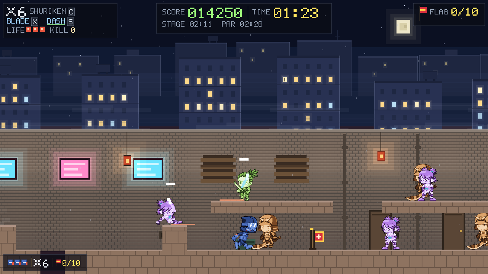

**성능은 측정합니다, 추측하지 않습니다.** `D` 디버그 오버레이가 프레임 이동 평균과 지난 1초의
**최악 프레임**, 16.67ms 예산, update/draw 분할, 현재 화질 단계를 보여줍니다. 평균 8ms에
40ms 스파이크가 섞인 프레임은 플레이어가 느끼는 스터터이고 평균은 그것을 보고하지 않습니다.

이 계측이 존재하는 이유는 추측이 5배 틀렸기 때문입니다. 배경이 비싼 레이어처럼 보였는데,
`drawEntities`가 전체 draw의 **86%**였습니다 — 스테이지의 적 56마리 중 화면에는 둘뿐인데
나머지 54마리를 매 프레임 픽셀 단위로 허공에 칠하고 있었습니다. `update()`는 렌더러가
쓰여진 이후로 `ACTIVE_MARGIN`으로 적을 컬링해 왔고, `drawEntities`는 한 번도 그러지
않았으며 아무도 재본 적이 없었습니다. 프레임당 52,229 → **13,408** fillRect.

**화질은 스스로 내려갑니다.** 예산을 0.5초간 놓치면 가산 번짐 → 재·안개 순으로 장식이
빠지고, 2초간 여유로우면 되돌아옵니다. 게임플레이는 건드리지 않습니다 — 고정 스텝이 이미
어떤 프레임레이트에서도 **시뮬레이션이 동일함**을 보장하므로, 강등되는 것은 장식이고 살아남는
것은 게임입니다.

## 등장인물

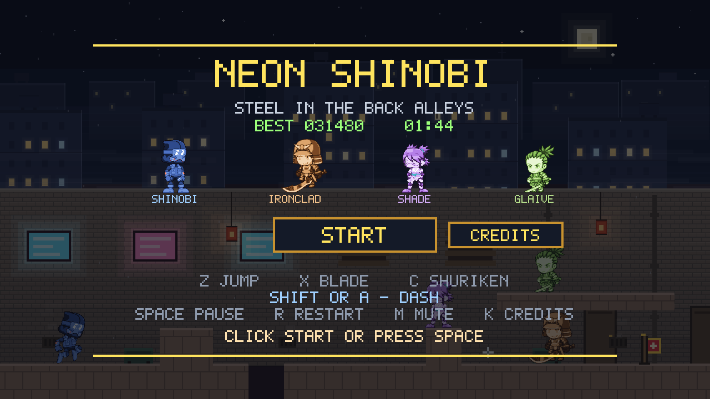

| 이름 | 역할 | 실루엣 | 원본 팩 | 명도 |
|---|---|---|---|---|
| **SHINOBI** | 주인공. 검이 기본, 수리검이 소모품, 대쉬로 거리를 번다 | 청색 닌자, 가장 좁은 몸 | Ninja Adventure (CC0) | 88 |
| **IRONCLAD** | 중장. 접근 후 윈드업–스윙, 중거리에서 런지 | 갑주 사무라이, 양손검, **최대 폭(62)** | FH SamuraiHeavy (CC-BY) | 119 |
| **SHADE** | 경장 돌격. 달려와 도약하고 벽을 넘어온다 | 보라 닌자, 가장 얇음 | Ninja Girl (CC0) | 136 |
| **GLAIVE** | 고정 원거리. 조준 후 강철 초승달을 던진다 | 녹색 사무라이, 낮은 무게중심(39) | FH SamuraiLight (CC-BY) | 166 |

**네 몸체가 모두 다릅니다.** 처음에는 팩 3개로 4명을 만들어서 GLAIVE가 주인공과 몸을
공유했고, IRONCLAD는 깃털 투구에 원형 방패를 든 **유럽 기사**였습니다. 주인공과 같은 몸은
플레이어가 눈을 찡그려야 하는 유일한 항목이고, 시노비 캐스트 안의 기사는 통일이 아닙니다.
Fantasy Heroes 팩 하나가 `SamuraiHeavy`와 `SamuraiLight`를 동시에 주면서 둘 다 해결됐습니다.

명도는 값 축에서의 분리입니다 — 주인공 88은 하늘 밴드(≤33)로부터 **55포인트** 떨어져 있어야
점프 정점에서 사라지지 않고, 적 셋은 그 위에 119/136/166으로 놓였습니다(최소 간격 17,
원작 팔레트의 간격과 동일). 이 수치는 `manifest.json`에 기록되고 **단정이 검사합니다** —
팔레트 상수를 보는 기존 단정은 아틀라스가 무슨 색이든 통과하기 때문입니다.

코드 안의 식별자는 `charger` / `rusher` / `warden` 그대로입니다. 그건 **행동**을 가리키는
이름이고 AI가 그 이름으로 쓰여 있으니 옳은 식별자입니다. 다만 플레이어에게는 한 번도
보여주지 않았고, 아트가 바뀐 뒤로는 화면에 있는 것을 설명하지도 못합니다 — "charger"는
깃털 달린 방패 든 덩치이고 "warden"은 강철 초승달을 던집니다. 그래서 표시 이름은
`FOE_NAMES`에 따로 있고, 상태 기계가 아니라 **아트에서** 골랐습니다.

## 단일 파일, 외부 애셋은 선택

`index.html` 하나가 게임 전부이고, 스프라이트는 그 안의 픽셀 배열이며 사운드는 실행 시점에
오실레이터로 합성됩니다. **그게 폴백입니다** — `frontend/assets/`를 비우면 그대로 동작합니다.

그 위에 **무료 애셋 층**이 올라갑니다:

| 파일 | 내용 | 출처 | 라이선스 |
|---|---|---|---|
| `assets/sprites.png` (60KB) | 39프레임 캐릭터 아틀라스 | 팩 3종 | CC0 + **CC-BY 3.0** |
| `assets/music.ogg` (1.9MB) | C64 Uptempo Chiptune, 152초 루프 | Skrjablin / OpenGameArt | CC0 |
| `assets/sfx-*.ogg` (11개) | 효과음 11큐 | Kenney RPG/Impact/Interface | CC0 |

**효과음 큐는 문서에서 골랐습니다.** `assets/README.md`가 각 큐가 *무엇이어야 하는지*를
적어두고 있어서, 여러 개는 거기서 바로 도출됩니다 — `bladeKill`은 "내장이 스윙 노이즈에 맞선
타종"이니 실제 종소리, `bump`는 "절대 피해를 입는 소리로 들려선 안 되는 둔탁한 몸통 충격",
`dryFire`는 100ms 무음정 클릭, `dash`는 천과 공기.

**길이 규약 2건은 파이프라인이 강제합니다.** `death`는 0.35초를 넘으면 프리즈 프레임 아래에서
웅웅거리고, `deathSting`은 음악이 끊긴 채 혼자 남으므로 ~1.05초 프리즈 안에 해결돼야 합니다.
`pack_assets.py`가 Ogg 헤더에서 길이를 읽어 초과 시 **빌드를 거부**하고, 단정이 빌드가 기록한
수치를 다시 검사합니다.

**들어보지는 못했습니다.** 이 기계에는 오디오 장치가 없습니다. 길이는 측정했고 음색은 팩의
설명을 신뢰한 것입니다. 큐가 틀렸다면 그 이유이고, 교체는 `pack_assets.py`의 `SFX` 한 줄입니다.

`frontend/tools/pack_assets.py`가 전부 받아서 게임 자체 팔레트로 리컬러해 굽습니다.
라이선스·출처·**거부한 후보**는 `frontend/assets/README.md`의 장부에 기록돼 있습니다.

**CC-BY 때문에 크레딧 화면이 생겼습니다.** `assets/README.md`는 이 아트가 오기 전부터
"CC-BY는 약속이다 — 크레딧이 README가 아니라 **게임 안에** 나와야 한다. 크레딧 화면이 아직
없으니 CC-BY 애셋을 넣기 전에 먼저 만들어라"라고 적어두고 있었습니다. 지금은 있습니다 —
타이틀에서 `K` 또는 CREDITS 버튼. `manifest.json`이 크레딧 의무가 있는 저작자를 기록하고,
그중 하나라도 그 화면에 없으면 **단정이 실패합니다.**

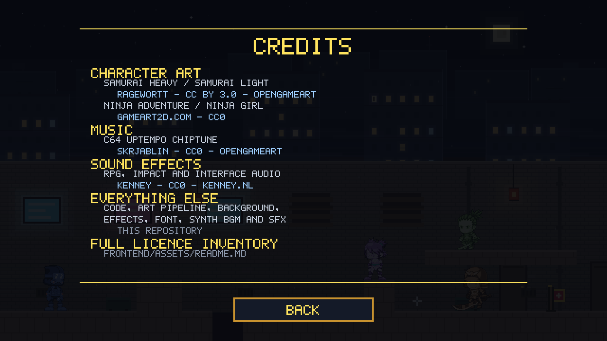

```bash
python3 frontend/tools/pack_assets.py          # 애셋 빌드
python3 frontend/tools/pack_assets.py --clean   # 내장 아트로 복귀
```

## 실행

```bash
open frontend/index.html          # 또는 브라우저로 파일을 그냥 열기
```

`file://`에서 그대로 동작합니다. 서버도 `npm install`도 필요하지 않습니다.


## 조작

| 키 | 동작 |
|---|---|
| `→` | 달리기 (전진 전용) |
| `↓` | 웅크리기 (전진하며 웅크릴 수 있음) |
| `Z` | 점프 (길게 누르면 더 높이) |
| `Shift` 또는 `A` | **대쉬** — 0.16초, 중력 정지. 공중 1회, 점프로 캔슬 |
| `X` | 검 — 기본 무기 |
| `C` | 수리검 — 소모품, 3발로 시작 |
| `Space` | 일시정지 / 재개 |
| `R` | 재시작 |
| `M` | 음소거 |
| `D` | 디버그 오버레이 |

## 게임 소개

**렌더 해상도.** 월드는 640×360 단위로 설계돼 있고 물리·판정·카메라·스테이지 수치는 전부
그 단위입니다. 그리는 버퍼만 `RENDER_SCALE`(=2)배인 1280×720이고, `render()`가 딱 한 번
`ctx.scale()`을 걸어서 나머지 그리기 코드는 이 사실을 알 필요가 없습니다.

목적은 HUD입니다. 640×360 버퍼에서 3×5 글리프는 한 글자에 15픽셀이고, 없던 디테일은
업스케일로 생기지 않습니다 — 계기판이 거칠어 **보였던** 게 아니라 실제로 거칠었습니다.
2배 버퍼에서는 글리프에 네 배의 픽셀을 쓸 수 있으므로 HUD 폰트는 **5×7**이고, 0.5단위
(=1 디바이스 픽셀) 헤어라인도 그릴 수 있습니다. 벽돌 줄눈도 이 정밀도로 다시 그렸습니다.

스프라이트는 영향이 없습니다. 정수 월드 좌표는 2×2 디바이스 블록에 떨어지므로 같은 그림이고,
`imageSmoothingEnabled = false`가 아틀라스 blit을 최근접 보간으로 유지합니다.

640×360 월드, 16px 타일, 22행 고정. 스테이지는 40타일 세그먼트를 이어 붙여 만들고
396타일에 도달하면 종료됩니다. 목숨 3개, 논리는 60fps 고정 스텝(`STEP = 1/60`)으로 돌고
렌더는 그와 분리돼 있습니다.

**대쉬는 속도가 아니라 거리를 줍니다.** `MOVE_SPEED`는 스테이지 파 예산을 역산한 값이라
움직일 수 없습니다 — 대쉬가 "더 빠른 걷기"였다면 모든 런의 채점 기준을 다시 써야 합니다.
그래서 0.16초 동안 340px/s로 **56px**을 덮고(같은 시간에 걸으면 25px) 그 뒤 걷기 속도로
몸을 돌려줍니다. 중력이 꺼져 있어 포물선이 아니라 평평한 활주이고, 그게 순보(瞬歩)로 읽히는
지점입니다. 공중에서는 체공당 1회, 점프가 대쉬를 **캔슬하면서 수평 속도를 물려받습니다**.
무적 시간은 없습니다 — 있으면 게임의 모든 공격에 대한 정답이 되어버립니다.

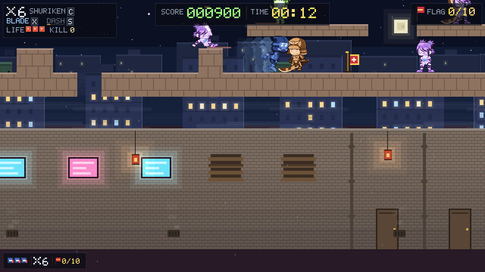

**점프는 커지지 않고 단단해졌습니다.** 400/1000/2400 → 430/1180/2700. 정점은 v²/2g = 78px로
스테이지 기하가 재단된 그 ~4.8타일을 유지하고, 상승 시간만 400ms → 364ms로 줄었습니다.
`JUMP_VEL`만 올렸다면 정점이 올라가 4행 계단 규칙이 깨졌을 겁니다.

**전진 전용 설계.** 뒤로 걷는 키가 없습니다. 카메라는 되돌아가지 않고, 스테이지 통과 예산도
최고 속도(150px/s)에서 역산해 잡혀 있습니다. 대신 이동에 무게가 있어서 가속·마찰·턴 부스트가
따로 있고, 점프에는 코요테 타임과 점프 버퍼가 붙어 조작이 무르지 않습니다.

주인공 포즈 전체 — idle, 걷기 4프레임, 웅크리기, 발도, 베기, 점프:

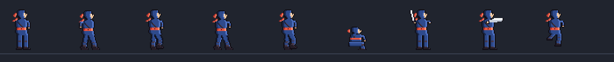

## 아트 파이프라인

`frontend/tools/pack_assets.py`. 의존성 0(순수 파이썬 PNG 인코더/디코더 포함),
CC0 팩을 받아 39프레임 아틀라스와 manifest를 굽습니다. 배운 것들이 그대로 주석에 있습니다.

**왜 리컬러하는가.** 취향이 아닙니다. 원본 닌자의 기(gi)는 `#320636`, 명도 19입니다.
이 게임의 모든 하늘 밴드는 명도 33 이하이고, 가독성 규칙은 열린 하늘로 점프하는 몸에
**40포인트 간격**을 요구합니다 — 원본을 그대로 쓰면 점프 정점마다 주인공이 사라집니다.
게다가 작가 3명의 캐릭터 4명은 서로 아무 공통점이 없습니다. 게임 자체 램프로 통과시키면
하나의 캐스트로 읽힙니다.

**히스토그램 평활화**이지 선형 스트레치가 아닙니다. 선형 매핑은 원본의 지배색 —
그게 곧 **가장 어두운** 몸통색이고 픽셀의 23%입니다 — 을 램프 맨 아래로 보내서, 캐릭터가
림라이트 달린 검은 덩어리로 나옵니다. 평활화는 가장 큰 버킷을 램프 **중앙**으로 보냅니다.
기본색이 있어야 할 자리입니다.

**램프 길이가 명도를 정하고, 명도가 가독성 예산입니다.** 첫 빌드는 주인공 램프에 기의
림하이라이트(`#8FAEEE`, 명도 177)를 포함시켜 평균을 101로 끌어올렸고, 러셔는 105에
떨어졌습니다. 파랑과 보라가 같은 명도인 것은 전형적인 혼동 쌍이고, 원본 팔레트는
그 둘을 의도적으로 73 차이로 벌려놨습니다. 지금은 주인공 80, 적 131/136/168입니다.

**색상은 램프에 양자화**합니다(보간 아님). 나머지 게임이 전부 플랫 셰이딩인데 그 옆의
부드러운 그라디언트는 누가 붙여넣은 사진처럼 읽힙니다.

**순서가 중요합니다.** 다운스케일을 **먼저**, 리컬러를 나중에. 박스 필터 전에 양자화하면
필터가 팔레트 항목들을 평균 내서 팔레트에 없는 색을 만듭니다.

**프레임 박스는 측정합니다, 고르지 않습니다.** 첫 빌드는 72×104로 고정해서 39프레임 중
27개를 잘랐습니다 — 슬라이드는 낮고 긴 몸이고, 내려찍기는 머리 위로 올라가며, 기사는
닌자보다 절반 더 넓습니다. 지금은 2패스입니다: 1패스가 모든 포즈의 발 중심 기준 좌우
확장과 발 위 높이를 재고, 2패스가 최악을 담을 박스에 배치합니다. 발 중심 기준 **대칭**
박스여야 하는 이유는 로더가 프레임을 수평 중앙 정렬하기 때문입니다.

**걷기 4위상은 측정으로 고릅니다.** 접지 프레임은 사이클에서 두 발 간격이 가장 넓은 프레임,
통과 프레임은 가장 좁은 프레임입니다. 엔진이 이동 거리로 A→B→C→D를 돌리므로 A와 C가
두 개의 접지여야 합니다. 눈대중이 아니라 숫자로 뽑습니다.

**accent 라우팅 임계값은 캐릭터별입니다.** 난색·고채도 픽셀을 accent 램프로 보내는 규칙은
스카프가 있는 닌자에게는 맞지만, 사무라이는 **몸통 자체가 난색**입니다(중장의 갑주는 hue 5
채도 0.58, 경장의 최대 단일색은 피부 `#E6AB6C` hue 31로 전신의 18.6%). 일괄 임계값은
캐릭터 전체를 스카프색으로 칠하고, 첫 빌드에서 IRONCLAD를 명도 88(주인공 80)로 떨어뜨렸습니다.
두 사무라이는 라우팅을 끄고 순수 명도 램프에 맡깁니다 — 피부가 가장 밝으니 램프 위로,
갑주가 중간, 속옷이 아래로 자연스럽게 갑니다.

**FH 팩의 한계 하나는 감수했습니다.** gameart2d 사이클은 10프레임에 **두 걸음**이 들어
있고 발 간격이 0.14~0.76으로 흔듭니다. FH는 10개 파일에 **고유 프레임 5개**를 왕복시킨
것이라 저진폭 한 걸음뿐이고, 두 번째 접지가 존재하지 않습니다. 적의 4위상은 그중 가장
구별되는 4프레임(Walk보다 간격이 넓은 Run에서)으로 만들었고, 정확한 2보 사이클이 아니라
'걸음걸이'로 읽힙니다. **주인공은 gameart2d 몸을 유지**하므로 진짜 4위상을 그대로 씁니다.

**검이 기본 무기, 수리검이 소모품입니다.** 검은 궤적이 그려지고 발도(draw) 3프레임 뒤에야
판정이 생깁니다. 칼이 나오는 모습이 먼저 보이고 맞는 판정이 뒤따르므로, 눈으로 보고
반응할 수 있습니다.

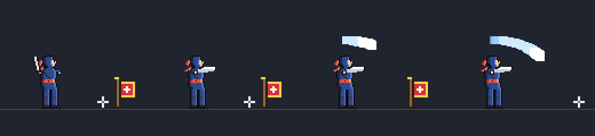

**적 3종.** 각자 다른 압박을 겁니다.

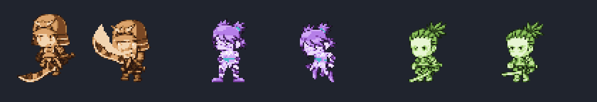

| 적 | 색 | 성격 | 패턴 |
|---|---|---|---|
| **Charger** | 황갈색·붉은 투구 | 중장 검사, 가장 넓은 몸 | 접근 후 윈드업–스윙, 중거리에서는 런지로 파고듦 |
| **Rusher** | 보라색 | 경장 돌격 | 오른쪽에서 달려오며 도약, 벽을 넘어옴 |
| **Warden** | 녹색·올리브 | 고정 원거리 | 조준 후 사격, 근접하면 버스트·백스텝·근접 쓸기 |

세 종류의 기본 자세와 걷기 4위상:

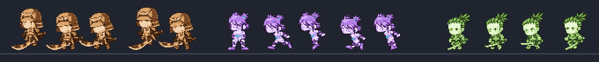

## 유효 범위가 보입니다

**공격 준비(armed)와 공격 범위(live)는 서로 다른 질문입니다.**

준비 단계는 *아직 존재하지 않는* 박스에 대해 **어디**와 **언제**를 답해야 하므로, 그 박스를
만들 때 쓸 상수에서 예측합니다. 도달 범위는 **첫 프레임부터 꺾쇠로 온전히** 표시됩니다 —
"어디"가 가장 먼저 필요한 정보이기 때문입니다. 그 뒤를 채워 올라가는 것이 시계입니다.
(이전에는 외곽선이 채움과 *함께* 밝아져서, 반응해야 하는 첫 프레임에 도달 범위가 화면에서
가장 희미했고 유일하게 선명한 것은 공격자 발치의 얇은 조각이었습니다.)

라이브 단계는 예측하지 않습니다 — **실제로 당신을 죽이는 `hazards` 배열에서 직접 읽습니다.**
어긋날 여지가 없습니다: 박스가 움직이면 그림이 움직이고, 살아 있는 박스에 아무 표시가 없는
상태는 이제 *불가능*합니다. 이게 비어 있던 부분이었습니다 — 준비는 미리 보여주고 라이브
프레임에는 무기 궤적만 있었으니, 범위가 가장 중요한 그 순간에 아무것도 표시되지 않았습니다.

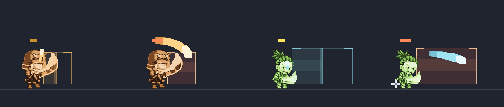

채움은 의도적으로 얇습니다. 첫 시도는 0.24 위에 0.22 코어를 겹쳐 어두운 골목에서 **불투명한
판**이 됐고, 플레이어가 탈출로를 찾는 자리에 판을 놓는 것은 스캔라인 격자와 같은 실수입니다.
읽히게 하는 것은 **꺾쇠와 양쪽 면**이고 채움은 색조만 얹습니다.

**조준선은 총알이 멈추는 곳에서 멈춥니다.** 예전에는 지형과 무관하게 `WARD_RANGE` 전체를
그려서 엄폐 블록을 **관통**하고 그 너머 땅까지 치명적인 것처럼 표시했습니다 — 블록의 존재
이유와 정반대이고, 이 게임 유일한 엄폐물을 쓸모없어 보이게 만들었습니다. 이제 광선을
**총알이 움직일 때 쓰는 그 판정**(`blockedAt`, 총알 자신의 박스와 높이)으로 걸어가므로,
선이 주장하는 것과 실제 사거리가 어긋날 수 없습니다.

**적의 무기가 보입니다.** 모든 적 공격에는 히트박스와 한 프레임짜리 포즈, 머리 위 4픽셀
표식이 있었습니다. 그건 휘두름이 아닙니다 — 박스는 안 보이고 포즈는 움직이지 않으니, 맞는
것이 "몸통에 걸어 들어간 것"으로 읽혔습니다. 이제 셋 다 실제 강철을 휘두르거나 찌르고,
그 기하는 **히트박스와 같은 상수에서 파생**되므로 그림이 당신을 죽이는 것과 어긋날 수
없습니다. 윈드업은 무기를 들어올리고 박스의 **발자국을 해칭**으로 깔아줍니다.

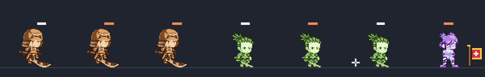

(첫 시도는 180도 궤적 전체를 낮은 알파로 미리 그렸는데, 얇은 띠가 반 바퀴를 돌면 시각적으로
닫혀서 **올가미를 돌리는 것**으로 읽혔습니다. 텔레그래프는 궤적이 아니라 박스입니다.)

**높이가 위협 축이 되었습니다.** 예전 규칙은 "모든 적은 플레이어가 걷는 바닥에 선다"였고,
그 근거는 당시 AI에 대해 옳았습니다 — 선반 위 워든은 수평으로 쏘고 탄이 머리 위 64px로
지나가므로, 높은 적은 싸울 수도 싸움을 걸 수도 없는 장식이었습니다. 그래서 선반은 픽업을
놓는 자리였습니다.

지금은 발이 20행보다 위에서 시작하는 마커가 **파수꾼(sentry)으로** 스폰합니다. 엄폐 블록과
플랫폼 위 32~96px 높이에 18개소. 자기 아래 골목 띠를 지켜보다가, 당신이 그 띠에 들어오면
**웅크리고**(유일한 경고, 420ms) **무기를 앞세워 떨어집니다**. 웅크림은 낙하 경로와 착지
패드를 바닥에 그려줍니다 — 플레이어의 눈이 있는 곳은 처마가 아니라 바닥이니까요.

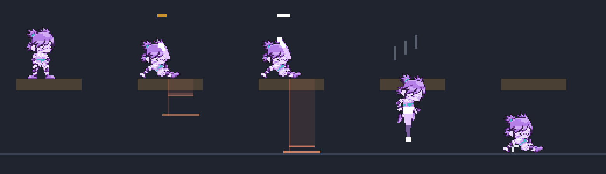

실제 골목에서, 실제 카메라로:

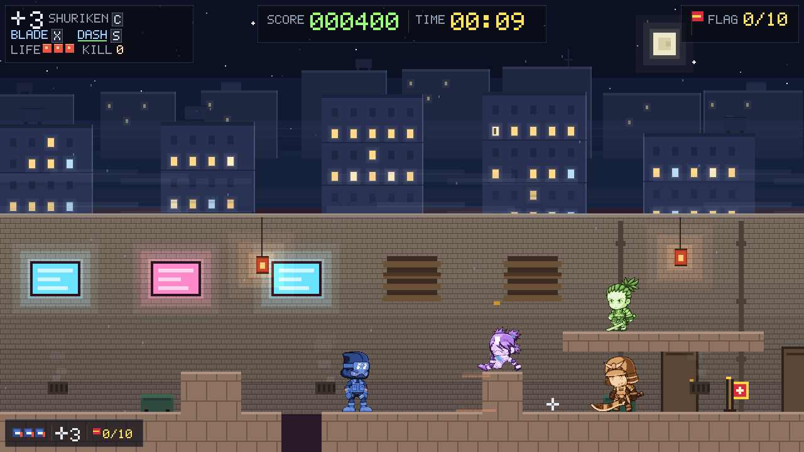

(낙하 경로는 파수꾼의 열이 아니라 **착지할 열**에 그립니다. 자기 열에 그리면 32px 엄폐
블록 위에 선 몸의 경로가 그 블록 안에 온전히 들어가 보이지 않습니다.)

**벽 돌파 연출.** 화면 밖 벽 위에서 적이 먼저 **엿보고**(peek) → **올라타고**(climb) →
**넘어와**(vault) → **착지 경직**(vaultLand)을 겪습니다. 연출 중에는 판정이 없고 착지 후에야
취약해지므로, 반응할 시간이 보장됩니다. 아래는 넘어오는 중간 단계입니다.

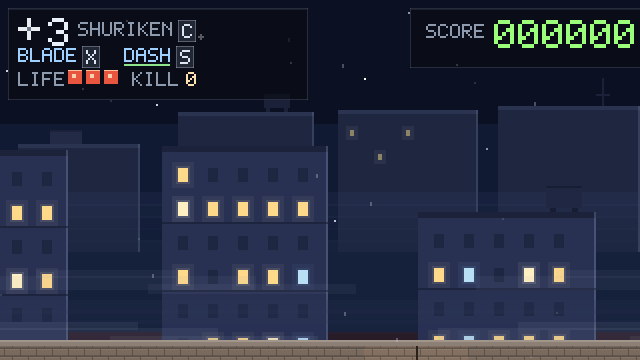

## 사살 — 폭죽에서 타격으로

예전 효과는 **몸이 있던 자리에서 밝은 입자가 방사형으로 터지는 것**이었고, `dying` 0.35초
동안 **시체는 아예 그려지지 않았습니다.** 그 둘을 합치면 폭죽입니다.

**① 시체는 사라지지 않고 무너집니다.** 이제 dying 창 전체를 그립니다 — 웅크리고, 가라앉고,
착지 지점에 먼지를 뿌리고, 사라집니다. 스프라이트는 회전할 수 없으니 붕괴는 **각 팩의 죽음
애니메이션에서 가져온 두 프레임**(중간 `falling`, 최종 `down`)으로 만듭니다. 처음에는 한
프레임만 썼는데, 타격 2프레임 뒤에 몸이 바닥에 납작하게 놓여서 **시체가 무너진 게 아니라
나타난 것**으로 읽혔습니다. 그 앞의 임팩트 프레임까지 합치면 눈은 "서 있음 → 누움"만 보고
그 사이가 없었습니다.

(그 과정에서 아틀라스의 `coil`이 **실제로 웅크림이 아니라는** 것도 드러났습니다 — FH 팩에서는
`Alert2H`, 즉 준비 자세입니다. 붕괴에 그걸 쓰니 무너지는 몸이 **일어서는 것처럼** 보였습니다.)

**② 파편은 원이 아니라 원뿔입니다.** 원은 "이게 폭발했다"고 말하고, 원뿔은 "저 방향에서
맞았다"고 말합니다. 이 한 가지가 사살이 폭죽으로 읽히는 것을 멈추게 한 변경입니다. 방향은
칼의 고정된 `sl.dir`과 표창의 `vx` 부호에서 옵니다.

파편은 **각자 중력 배율과 공기 저항**을 갖습니다. 무거운 조각은 짧게 호를 그리다 멈추고
가벼운 부스러기는 날아갑니다. 모든 조각에 같은 중력을 주면 전부 같은 포물선을 따르고, 눈은
그걸 **종이**로 읽습니다. 걷는 속도 아래로 떨어지면 멈춰서 남습니다 — 날아가는 중에 사라지는
파편은 연기로 읽히고, 착지하는 파편은 파편으로 읽힙니다.

**③ 반짝임을 뺐습니다.** 예전 색 목록은 `[G, H, D, 흰색, 금색]`이었고 마지막 둘이 폭죽의
대부분이었습니다 — 밝은 난색 입자가 몸에서 사방으로 나가는 것은 폭죽입니다. 다만 첫 수정은
너무 멀리 갔습니다: **윤곽선 색(K, 명도 38)**으로 바꾸니 골목 벽(108)에 파편 18개가 전부
묻혀버렸습니다. 지금은 몸 자신의 그림자·기본·명부 톤이고, 몸의 일부로 읽히면서 벽에 대비됩니다.

**④ 무기에 따라 다릅니다.**

| | 칼 (참살) | 표창 (관통) |
|---|---|---|
| 파편 | 넓은 원뿔(0.62rad) 15개 + 절단선 따라 빠른 분사 7개 | 좁은 원뿔(0.26rad) 9개 |
| 전용 표시 | **절단선** — 몸을 가로지르는 각진 두 선, 5프레임, 가산 발광 | **관통 표시** — 상처 지점에만 밝은 입자 4개 |
| 넉백 | 4px | **9px** (그 에너지가 가는 곳) |
| 히트스톱 | 4프레임 | 2프레임 |
| 붕괴 시간 | 0.58s | 0.46s |

절단선이 칼에만 있는 이유: 없으면 두 죽음의 차이가 **파편의 양**뿐이고, 플레이어가 들어야
하는 것은 **종류**의 차이입니다.

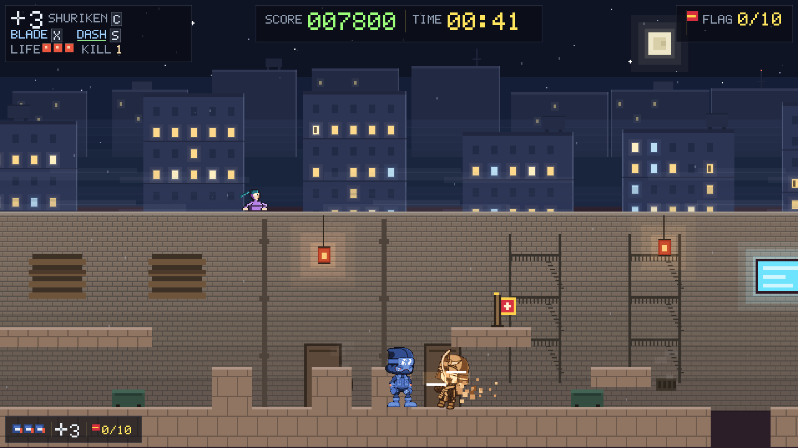
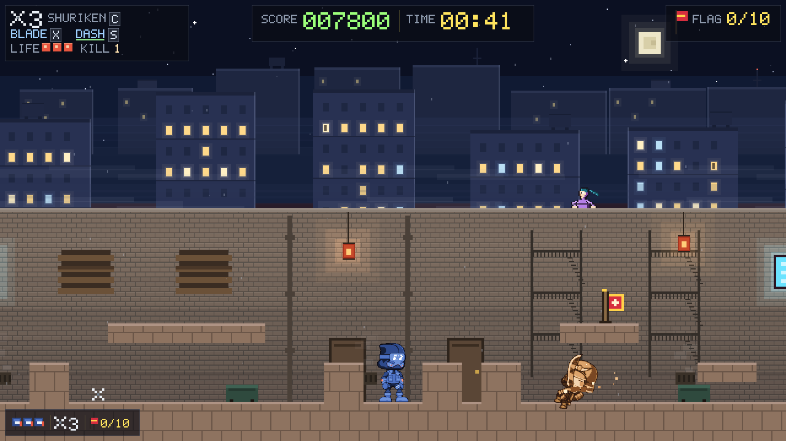

**타격은 무게가 있습니다.** 트라우마 스칼라 기반 셰이크입니다 — 타이머가 아니라 감쇠하는
스칼라이므로 **누적됩니다**. 3프레임 간격의 두 처치가 합쳐지지, 두 번째가 첫 번째를 같은
진폭에서 재시작하지 않습니다. 오프셋은 트라우마의 **제곱**이라 톡 치는 것과 내려찍는 것이
두 시스템이 아니라 한 곡선 위에 놓입니다. 항상 정수 픽셀로 반올림합니다 — 최근접 업스케일
아래의 서브픽셀 카메라 이동은 화면 전체를 기어가게 만드는 시머이고, 배경 레이어들이 바로
그걸 피하려고 만들어져 있습니다.

**펀치는 별개이고 방향이 있습니다.** 진동은 "무언가 일어났다"고 말하고, 타격이 진행한 방향으로
몇 픽셀 밀려났다 돌아오는 시야가 "그 타격에 무게가 있었다"고 말합니다. 셰이크만으로는 절대
무겁게 읽히지 않습니다. 셰이크는 **액션 레이어만** 움직이고 배경은 고정입니다 — 패럴랙스
레이어는 화면에 고정된 전폭 띠라서 밀면 한쪽 끝에 맨 캔버스가 드러나고, 흔들린 전경 대 고정된
하늘이 "카메라가 맞은" 것이 아니라 "카메라 앞에서 타격이 터진" 그림입니다.

**임팩트 프레임**은 몸이 이미 죽은 뒤, 파편이 퍼지기 전 두 프레임 동안 그 포즈 모양의 평면
흰색입니다. 격투 게임에서 가장 오래된 수법이고 여전히 가장 싼 방법입니다.

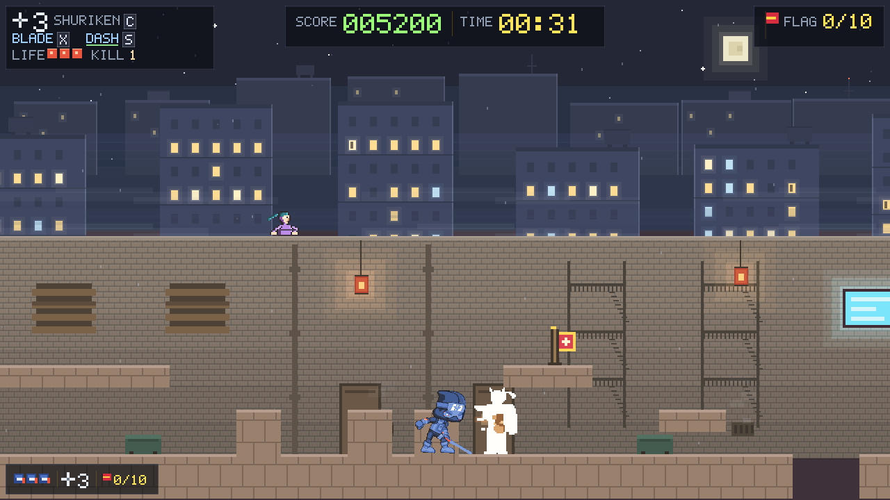

**히트스톱은 계층화했습니다.** 이 문서의 이전 판은 "검 처치는 소리만 다른 원거리 처치"라고
단정했고, 그 역사는 남겨둘 가치가 있습니다. 원래 불만은 근접 처치가 원거리보다 **못하게**
느껴진다는 것이었고, 해결은 죽음을 동일하게 만들고 소리만 다르게 하는 것이었습니다 — 진짜
범인은 처치보다 오래 살아남아 파편 위에 앉아 있던 26px 폭의 흰 궤적이었습니다.

동일함은 그 버그에 대한 옳은 처방이었고, 머무를 자리는 아니었습니다. 팔 길이의 카타나가
골목 건너에서 던진 수리검과 정확히 같은 무게로 착지한다면, 둘 사이의 선택은 탄약에 대한
선택일 뿐입니다. 그래서 검이 더 무거운 타격입니다 — 파편 22 대 16, 히트스톱 83ms 대 50ms,
더 강한 밀어냄. 반면 **결과**를 정하는 모든 것은 동일합니다: 같은 `killEnemy()`, 같은 점수,
같은 처치 수, 같은 리스폰. 느낌은 다르고 결과는 같다 — 그 분리를 단정이 고정합니다.

## 가만히 서 있어도 멈춰 있지 않습니다

적은 걷지도 공격하지도 않을 때 **픽셀 단위로 동일한 한 포즈**를 유지했고, 배치된 보초에게는
그게 화면에 나오는 시간의 전부였습니다. 움직이는 골목 안에서 그건 오려붙인 종이로 읽힙니다.
주인공은 처음부터 `NINJA_IDLE` / `NINJA_IDLE_B`를 갖고 있었고 적은 없었습니다.

이제 `enemyGait`가 `base`/`idleB`를 교대합니다. `animTime`은 `resetEnemies`에서 적별로
`i * 0.11` 시드가 들어가므로 **한 줄로 늘어선 보초들이 한 몸처럼 맥동하지 않습니다.**
`idleB`는 각 팩의 **실제 idle 애니메이션에서 뽑은 두 번째 프레임**이고(내장 폴백은 `breathe()`가
한 행 내려 만듭니다), FH 팩은 Stand가 5프레임 왕복이라 양 극단인 0번과 4번을 씁니다 —
3번은 0번과 한 픽셀 차이여서 교대가 보이지 않았습니다.

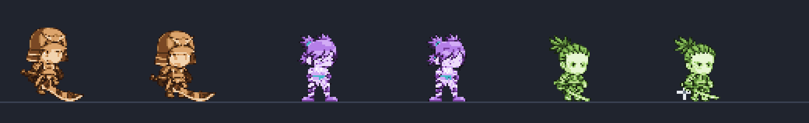

**코드로 무기를 그리려던 시도는 폐기했습니다.** 처음에는 쉬는 자세의 무기를 코드로 그려
천천히 들었다 내리게 했습니다. 아트가 도착한 순간 그건 틀린 것이 됐습니다 — 내장 픽셀
배열은 무기를 팔레트 속 강철 몇 픽셀로 갖고 있지만, 교체된 스프라이트는 무기를 **들고
있습니다**. 사무라이는 양손에 카타나를, 러셔는 허리에 칼을. 그 위에 선을 그으니 서 있는 모든
적에게 **두 번째 무기**가 생겼습니다. 두 손으로 두 자루를 든 몸입니다.

대기 모션은 포즈가 맡는 것이 옳았고, 필요했던 단 하나는 "픽셀 동일하지 않기"였으며 그건
작가가 이미 그려놓았습니다. **공격 궤적은 남깁니다** — 그건 스스로 휘두를 수 없는
스프라이트 위에 칼이 지나간 자리를 그리는 *모션*이고, 두 번째 물체가 아니라 블러로 읽힙니다.

## 2층 골목

row 16에는 4타일짜리 디딤돌만 있었습니다. 지금은 **싸울 수 있을 만큼 긴 보행로**가 8개
세그먼트에 10개 있습니다(7~17타일). 바닥에서 **4타일 = 64px** 위이고 정점은 78px이므로
디딤 블록 없이 한 번의 점프로 올라가고, 내려올 때는 걸어 내려옵니다.

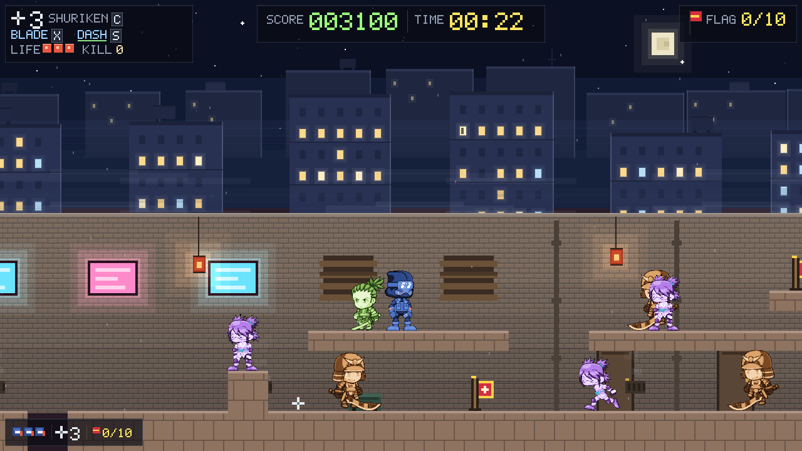

아래 골목은 그대로 통합니다 — rows 17·18·19가 비어 있고 그건 정확히 `BODY_H`입니다.

**두 가지 제약이 배치를 결정합니다.**

**① 엄폐 블록 위를 덮지 않습니다.** 덮으면 적이 뛰어넘어야 하는 바로 그 타일에 천장이
생겨서 — 머리 공간 없음 + 앞에 벽 — 스테이지 검증이 로드를 거부하는 **데드락 포켓**이
됩니다. 첫 시도에서 7개가 걸렸습니다. 여유는 2칸이고, 그건 `hopIfBlocked`의
`headroom(e, 2)` 그 값입니다.

**② 구덩이 위를 덮지 않습니다.** 이건 더 비싸게 배웠습니다. 구덩이에 천장을 씌우면 그
**입구의 하늘**이 사라지는데, 입구는 적이 "도약할 수 있는가"를 판단하는 지점입니다. 챠저는
가장자리에서 멈췄고(안전) **러셔는 그대로 뛰어들어 추락했습니다.** 간격 횡단은 적 AI가
자기 머리 위 지형을 읽는 유일한 곳이므로, 간격 위는 짓지 않을 유일한 곳입니다.

그 과정에서 `isPitCol`이 **모든 행**을 훑고 있었다는 것도 드러났습니다 — 위에 무엇이든
지어지는 순간 그 열은 구덩이가 아니게 됩니다. row 16이 비어 있을 때는 무해했지만, 보행로가
생기자 스테이지 대부분의 구덩이가 조용히 구덩이가 아니게 됐고 **둘이 동시에 침묵할**
뻔했습니다: 구덩이 입구 규칙과 구덩이 폭 다양성 검사. 천장이 있어도 떨어집니다 —
**바닥 행만** 판정합니다.

## 좌측 하단 표시

상단 플레이트가 같은 숫자 3개를 갖고 있지만 찾기 어렵습니다 — 스카이라인 위, 화면에서 가장
밝은 영역에 있고, 전진 전용 게임에서 시선은 닌자와 땅이 있는 **아래쪽**에 삽니다. 그래서
싸우는 **동안** 확인하는 세 가지(목숨·수리검·깃발)를 액션에 가장 가까운 모서리에 압축해
놓았습니다. 상단은 그대로 둡니다 — 점수와 시계를 싸움 사이에 읽는 자리이고, 이건 대체가
아닙니다.

**1행입니다.** 3행으로 쌓았을 때는 플레이트가 44px 높이로 플레이필드까지 올라와 소품과
플레이어가 읽으려는 땅을 덮었습니다 — 설명하려는 대상을 가리는 HUD입니다. 가로로 놓으니
22px이고 모든 것 아래에 앉습니다.

## 소리가 아예 나지 않던 버그

`audioUnlock()`이 **일시정지된 컨텍스트를 재개하지 않았습니다.**

제스처 밖에서 만든 AudioContext는 생성은 성공하고 **suspended 상태로** 시작합니다. 애셋이
없을 때는 무해했습니다 — `loadCues()`가 오디오를 건드리기 전에 반환했으므로, 첫 키 입력이
제스처 안에서 컨텍스트를 만들고 running으로 시작했습니다.

manifest가 오디오를 선언한 순간부터 `loadCues()`가 페이지 로드 중에 컨텍스트를 만들기
시작했고 — `decodeAudioData`가 컨텍스트를 필요로 하고 suspended에서도 동작하므로 그건
옳습니다 — 그때부터 `if (actx) return` 가드가 이후의 모든 제스처를 no-op으로 만들었습니다.
컨텍스트는 존재하고, 큐는 디코드되고, 스케줄러는 돌고, **세션 내내 아무것도 들리지
않았습니다.** 애셋이 있으면 음악도 효과음도 없었습니다.

그래서 두 일을 분리했습니다: **최대 한 번 만들고, 제스처가 올 때마다 running이 될 때까지
재개한다.** `pointerdown`과 `touchstart`도 잡습니다 — 타이틀 화면에서는 오디오를 여는 클릭이
게임을 시작하는 클릭과 같으므로, 누름보다 늦은 무엇이든 오프닝이 무음이라는 뜻입니다.
로딩 화면도 음악을 원하므로(그 대기 중에 큐 디코드가 끝납니다) 오프닝은 플레이어가 보는
첫 프레임부터 음악이 있습니다.

**점수.** 처치 100, 픽업 250, 깃발 500에 통과 시간 보너스. 깃발 10개는 선택 수집이고
못 모아도 스테이지는 끝납니다.

## 구조

```
frontend/
  index.html        게임 본체 — 이 파일 하나가 전부입니다 (약 6,000줄)
  verify.mjs        헤드리스 검증 하니스 — 단정 969건
  tools/
    pack_assets.py  CC0 애셋 → 아틀라스 파이프라인 (의존성 0)
  assets/
    sprites.png     39프레임 아틀라스 (60KB)
    music.ogg       C64 업템포 칩튠 루프 (CC0, 1.9MB)
    sfx-*.ogg       효과음 11큐 (CC0, Kenney)
    manifest.json   프레임 표 + 버전 + 라이선스/명도/길이/크레딧 메타

## 새로고침 버그

`manifest.json`은 `no-cache`로 받는데 아틀라스는 `Image`의 `src`로 로드돼 브라우저가 일반
이미지처럼 캐시합니다. 그래서 리빌드 후에는 **새 manifest가 낡은 `sprites.png`를 가리키고**,
타이틀 화면을 새로고침하면 이전 캐스트가 서 있었습니다. manifest에 **내용 해시** 버전을 넣고
모든 애셋 URL에 `?v=`를 붙여 해결했습니다 — 타임스탬프가 아니라 해시이므로 아트가 바뀌지
않은 리빌드는 캐시를 그대로 씁니다.

같은 증상의 두 번째 원인도 있었습니다: `loadAssets()`를 던져놓고 즉시 그리기 시작해서 첫
프레임들이 **내장 픽셀 배열**을 그린 뒤 아틀라스로 교체됐습니다. 이제 부팅이 로딩 화면에서
대기합니다 — 다만 **마감 시간(2.5초)과 함께**입니다. 걸려서 안 풀리는 로딩 화면은 깜빡임보다
나쁜 실패이고, `fetch`나 타이머가 없으면(`file://`, 헤드리스 하니스) 기다릴 것이 없으므로
전환이 동기적으로 일어나 예전처럼 곧장 타이틀로 부팅합니다.

그 과정에서 **별개의 버그**를 찾았습니다. `update()`의 "아무것도 시뮬레이션하지 않는" 목록에
`credits`가 빠져 있어서, 타이틀에서 크레딧을 열면 전체 화면 오버레이 뒤에서 골목이 조용히
시작됐습니다 — 적이 깨어나고 웨이브 타이머가 돌고 런 클럭이 올라가고 주인공이 스폰 타일에서
걸어 나갔습니다. 세 오버레이 모두 단정이 검사합니다.
  shot.mjs          PNG 렌더러 — 브라우저 없이 화면을 눈으로 보는 도구
  hero_sprites.py   주인공 스프라이트 저작 도구 (오프라인, 실행에 불필요)
  foe_sprites.py    적 스프라이트 저작 도구 (오프라인, 실행에 불필요)
  assets/README.md  선택적 에셋으로 내장 리소스를 덮어쓰는 방법
docs/
  *.png             이 README에 쓰인 캡처 — shot.mjs 출력물입니다
```

`index.html`의 `<script>` 블록은 주석 배너로 구획돼 있습니다. 고칠 곳을 찾을 때는
줄 번호 대신 이 배너를 검색하세요.

| 구획 | 내용 |
|---|---|
| `CONFIG` | 모든 튜닝 상수. 물리·판정·AI 수치가 여기 모여 있습니다 |
| `SPRITES` | 팔레트와 포즈 픽셀 배열 |
| `STAGE` | 세그먼트 조립, 적·픽업·깃발 배치 |
| `STAGE VALIDATORS` | 레이아웃 규칙을 로드 시점에 강제 |
| `STATE` / `SAVED STATE` | 런타임 상태, 기록 저장 |
| `AUDIO` | 오실레이터 합성 + 공유 노이즈 버퍼 |
| `LIT WINDOWS` | 창문 3계급(온색/TV/소등), 가산 합성 번짐, 거주자 실루엣 |
| `ATMOSPHERE` | 헤이즈 밴드, 흐르는 안개, 낙하하는 재, 달빛 림라이트 |
| `HIT FEEL` | 트라우마 셰이크, 방향성 펀치, 임팩트 프레임, 히트스톱 계층 |
| `ENEMY WEAPON MOTION` | 적 3종의 궤적·찌르기·윈드업 텔레그래프 |
| `LEDGE SENTRIES` | 상단 구조물 파수꾼의 perch → 웅크림 → 강하 → 착지 |
| `OPTIONAL ASSETS` | 외부 에셋 로더 (없으면 내장 사용) |
| `INPUT` / `MENUS` | 키 입력, 타이틀·일시정지·게임오버 |
| `COLLISION` | `solidAt` / `moveEntity` / `probeGround` |
| `PLAYER ACTIONS` | 점프·웅크리기·검·수리검 |
| `IMPACT FX` | 타격 연출 |
| `ENEMY AI` | 적 3종 상태 기계 |
| `CROSSING GAPS` | 벽 돌파(vault) 연출 |
| `UPDATE` / `RENDER` | 고정 스텝 갱신, 그리기 |
| `BACKGROUND` | 절차적 시차 배경 |
| `MENU SCREENS` / `LOOP` | 화면 전환, 메인 루프 |

## 개발 방법

이 프로젝트는 브라우저가 없는 환경에서 개발됐습니다. 그래서 개발 루프는
**단정 + 실제 이미지 확인** 두 축입니다.

```bash
# 1. index.html을 고친다

# 2. 동작이 깨지지 않았는지 단정으로 확인
node frontend/verify.mjs          # 969 passed, 0 failed 를 기대

# 3. 보이는 것이 맞는지 PNG로 굽고 눈으로 확인
node frontend/shot.mjs            # shot-*.png 생성
```

두 스크립트 모두 `index.html`의 `<script>` 블록을 정규식으로 뽑아 `node:vm` 샌드박스에서
실행합니다. `document`·`canvas`·`requestAnimationFrame`은 가짜 객체로 주입합니다.
자기 파일 위치를 기준으로 `index.html`을 찾으므로 어느 디렉터리에서 실행해도 됩니다.

**`shot.mjs`는 이제 작은 래스터라이저입니다.** 원래는 `fillRect` 레코더였는데, 아트가 픽셀
배열에서 아틀라스로 옮겨가는 순간 `fillRect`만 아는 레코더는 눈이 멀어버립니다 — 그리고 이
환경에는 그것이 유일한 눈입니다. 그래서 `fillRect`, `drawImage`(3/5/9인자),
`save`/`restore`, `translate`/`scale`, `globalAlpha`,
`globalCompositeOperation = "lighter"`를 지원하고, 가짜 `fetch`/`Image`로 `assets/`를
디스크에서 읽습니다. 게임이 쓰는 모든 그리기 프리미티브가 이 안에 들어옵니다.

**하니스가 갈라지는 지점이 중요합니다.** `verify.mjs`는 `ctx.scale()`을 no-op으로 두므로
기하 단정이 전부 월드 단위로 읽히고, `RENDER_SCALE` 도입 때 **단정을 하나도 고치지
않았습니다**. `shot.mjs`는 변환을 반영해 실제 버퍼 크기로 래스터하므로 브라우저가 보여줄
것을 보여줍니다. 논리는 월드 단위로, 외형은 디바이스 픽셀로 검증합니다.

`shot.mjs`가 굽는 이미지 — 실행한 디렉터리에 `shot-*.png`로 떨어집니다:

| 파일 | 내용 |
|---|---|
| `shot-title.png` / `shot-play.png` | 타이틀 화면, 플레이 화면 |
| `shot-cycle.png` | 주인공 9포즈 |
| `shot-enemy.png` / `shot-foewalk.png` | 적 3종 기본·공격, 걷기 위상 |
| `shot-wall1..5.png` | 벽 돌파 연출 5단계 |
| `shot-range.png` | 공격 준비 / 공격 범위 표시 |
| `shot-rest.png` | 대기 모션 (base / idleB) |
| `shot-kill-blade/shuriken/settle.png` | 사살 — 칼, 표창, 착지 후 |
| `shot-upper1..2.png` | 2층 보행로 — 바닥에서, 그리고 올라가서 |
| `shot-credits.png` | 크레딧 화면 |
| `shot-dash.png` | 대쉬 중간 — 잔상이 화면에 있는 10프레임 |
| `shot-foeattack.png` | 적 공격 모션 7종, 각자 가장 읽히는 프레임 |
| `shot-sentry.png` | 파수꾼 perch → 웅크림 → 강하 → 착지 |
| `shot-sentry-live1..2.png` | 실제 골목·실제 카메라의 파수꾼 |
| `shot-impact.png` | 검 처치가 착지하는 그 프레임 |
| `shot-arc.png` | 이동 중 검 궤적 |

`docs/`의 캡처가 바로 이 출력물을 골라 이름만 바꾼 것입니다. 루트 `.gitignore`가
`shot-*.png`를 무시하므로, 작업 중 생긴 출력물은 커밋에 섞이지 않습니다.

`shot.mjs`는 게임의 `ctx.fillRect` 호출을 전부 기록해 RGB 버퍼에 재생하고 zlib으로 PNG를
직접 씁니다. 이미지 라이브러리를 쓰지 않습니다.

### 검증 항목 추가하기

`verify.mjs`는 74개 구획에 걸쳐 `check(이름, 조건, 설명)` 한 줄씩을 쌓는 구조입니다.

```js
check("설명적인 이름", 실제 === 기대, `관측값 ${실제}`);
```

조건이 참이면 `PASS`, 거짓이면 `FAIL`로 집계되고 마지막에 합계가 나옵니다.
색상·대비처럼 픽셀을 직접 봐야 하는 항목도 래스터 버퍼를 떠서 단정합니다.

## 확장하기

대부분의 확장 지점은 **두 경로**를 가집니다. 코드에 내장된 버전을 고치는 길과,
`frontend/assets/`에 파일을 놓아 교체하는 길입니다. 전자는 `file://`에서도 동작하고
후자는 `http` 서빙이 필요합니다.

### 스테이지 추가

스테이지는 `STAGE` 구획의 `SEGMENTS` 배열입니다. 40타일 세그먼트 **10개**를 이어 붙여
400타일을 만듭니다. 세그먼트 하나는 **정확히 22줄, 각 줄 정확히 40글자**입니다.

```js
const SEGMENTS = [
  // segment 11 ← 배열 끝에 추가
  [
    "........................................",   // 22줄
    /* ... */
    ".........XXX............XX..............",
    "...P.....XXX............XX.C..S.....F...",
    "XXXXXXXXXXXXXX..XXXXXXXXXXXXXXXXXXXXXXXX",
    "XXXXXXXXXXXXXX..XXXXXXXXXXXXXXXXXXXXXXXX"
  ],
];
```

타일 문자:

| 문자 | 의미 | 문자 | 의미 |
|---|---|---|---|
| `X` | 지형 (solid) | `S` | Charger |
| `.` | 빈 칸 | `T` | Charger — 제자리를 지킴 |
| `P` | 플레이어 시작 지점 | `R` | Rusher |
| `C` | 수리검 픽업 | `G` | Warden |
| `F` | 수집 깃발 | | |

**세그먼트를 추가하면 `GOAL_TILE`을 함께 올려야 합니다.** 현재 `396`이고, 이 타일에
도달하면 깃발 수와 무관하게 스테이지가 끝납니다. 세그먼트를 더 붙여도 이 값을 그대로 두면
새 구간에 들어가기 전에 클리어됩니다.

치수가 틀리면 `buildStage()`가 로드 시점에 어느 세그먼트 몇 번째 줄인지 찍고 예외를
던집니다. 조용히 깨지지 않습니다.

레이아웃은 세 규칙을 지켜야 합니다. `STAGE VALIDATORS`와 `verify.mjs`가 둘 다 검사합니다.

1. **지형 블록은 2타일(32px) 높이.** 각 Warden의 접근 방향에 엄폐물이 하나 있어야 합니다.
   웅크리면 블록이 탄을 먹고, 서면 위로 던질 수 있습니다.
2. **높이 변화는 항상 4타일 행.** 몸이 3타일이고 점프 최고점이 약 4.8타일이라, 4행만이
   넘을 수 있으면서 아래에 머리 공간을 남깁니다. 3행은 바닥을 막고 5행은 닿지 않습니다.
3. **적은 플레이어가 걷는 지면에 서야 합니다.** 선반 위 Warden은 탄이 머리 위 64px로
   날아가 무해합니다. 선반에는 픽업을 놓으세요.

추가한 뒤 반드시:

```bash
node frontend/verify.mjs    # 전진 가능성·구덩이 도달성·교착 주머니를 단정합니다
```

### 캐릭터 에셋 변경

**경로 A — 내장 픽셀 배열 수정.** `.py` 두 개는 빌드 단계가 **아닙니다.** 출력물이 이미
`index.html`에 들어가 있어서, 스프라이트를 다시 손볼 때만 씁니다. Python이 없어도 게임은
돌아갑니다.

포맷은 문자 하나가 화면 픽셀 하나인 32×48 ASCII 배열입니다. 각 문자는 팔레트 키이고
`.`은 투명입니다.

```python
row(11, "KKKKKKK")          # 왼쪽 11칸 비우고 외곽선 7칸
row( 9, "KDDBBBBLfWKfK")    # K 외곽선, D 그림자, B 기본, L 밝은 면, f 피부, W 눈
```

```bash
python3 frontend/hero_sprites.py                      # 치수·팔레트 검증
python3 frontend/hero_sprites.py --show NINJA_IDLE    # 터미널에 포즈 출력
python3 frontend/foe_sprites.py                       # 적 포즈 전체 검증
```

`foe_sprites.py`는 `hero_sprites.py`의 `row`·`paste`·`chk`·`leg_pair`를 재사용합니다.
그래서 두 파일명은 **밑줄이어야 합니다** — 하이픈이 들어가면 파이썬이 import하지 못합니다.

검증을 통과한 배열을 `index.html`의 해당 포즈 상수에 붙여넣고, `node frontend/verify.mjs`의
래스터 단정과 `node frontend/shot.mjs`의 `shot-cycle.png`로 확인하세요.

**색만 바꾸려면 픽셀을 건드릴 필요가 없습니다.** `SPRITES` 구획의 팔레트 객체
(`P_NINJA`·`P_CHARGER`·`P_RUSHER`·`P_WARDEN`)만 고치면 됩니다. 램프 구조가 키로 고정돼
있어 같은 자리에 다른 색을 넣는 것으로 끝납니다.

```js
const P_NINJA = {
  K: "#0E0B12",   // 외곽선
  D: "#1B2A50",   // 기본 옷, 그림자 / 먼 쪽 팔다리
  B: "#2E4A8C",   // 기본 옷, 기본
  L: "#4E72C4",   // 기본 옷, 밝은 면
  H: "#8FAEEE",   // 기본 옷, 림 하이라이트
  /* ... */
};
```

단, 캐릭터 채도는 **0.30 이상**을 유지해야 합니다. 낮추면 배경과 구분이 안 되고
`verify.mjs`의 채도 분리 단정이 깨집니다.

**경로 B — 외부 아틀라스로 교체.** `frontend/assets/manifest.json`에 아틀라스 PNG와 프레임
좌표를 선언하면 내장 포즈를 프레임 단위로 덮어씁니다.

```json
{
  "atlas": "sprites.png",
  "frames": {
    "ninja/idle": { "x": 0, "y": 0, "w": 32, "h": 48 }
  }
}
```

교체 프레임은 내장 32×48 박스에 **하단 중앙 기준**으로 정렬됩니다. 그래서 크기가 다른
그림도 같은 발 위치에 서며, 전체 스프라이트를 한 치수로 다시 그릴 필요가 없습니다.
매니페스트의 오타는 **그 한 포즈만** 교체를 잃고, 아틀라스 전체를 무너뜨리지 않습니다.

### 음악 변경

**경로 A — 스텝 스케줄러 수정.** `AUDIO` 구획에 8마디 루프가 테이블로 들어 있습니다.

```js
const MUSIC_BPM  = 108;
const MUSIC_STEP = 60 / MUSIC_BPM / 2;   // 8분음표, 약 0.278초
const MUSIC_BAR  = 8;                    // 한 마디의 8분음표 수
const MUSIC_LEN  = 64;                   // 8마디, 약 17.8초
```

`MUSIC_CHORDS`는 마디당 한 항목씩 8개입니다. 현재 진행은 A단조의 i–VI–III–VII (Am F C G)
뒤에 iv–i–VI–V (Dm Am F E)가 붙는 구조입니다.

```js
{ bass: 110.00, notes: [220.00, 261.63, 329.63] },   // Am : A2 / A3 C4 E4
```

`MUSIC_MELODY`는 `[시작 스텝, 주파수, 길이(8분음표 수)]` 배열입니다.

```js
[ 0, 329.63, 3], [ 3, 440.00, 1], [ 4, 523.25, 2],
```

노트는 프레임 루프가 아니라 **오디오 클럭보다 앞서**(`MUSIC_LOOKAHEAD = 0.5`) 예약됩니다.
그래서 프레임이 길어져도 루프가 밀리거나 끊기지 않습니다. 대신 값을 바꿔도 이미 예약된
0.5초분은 옛 소리로 나옵니다 — 버그가 아닙니다.

마디 수를 바꾸려면 `MUSIC_LEN`과 `MUSIC_CHORDS` 길이를 함께 맞추세요.
`MUSIC_LEN = MUSIC_BAR × 마디 수`입니다.

**경로 B — 음악 파일로 교체.** 매니페스트에 `music` 큐를 주면 스텝 스케줄러를 아예
**대체**합니다. 위에 겹쳐 재생하지 않습니다.

```json
{ "audio": { "music": "alley-loop.ogg" } }
```

### 효과 추가

타격감은 독립된 세 층으로 쌓습니다. 새 효과도 같은 문법을 따르면 기존 연출과 붙습니다.

```js
spawnBurst(cx, cy, 16, [pal.G, pal.H, "#FFFFFF"], 180, 0.5);  // 1. 파티클
hitFreeze = 0.05;                                             // 2. 히트스톱 3프레임
flash = 0.10; flashCol = "255,250,225";                       // 3. 화면 틴트
```

| 층 | 함수·변수 | 의미 |
|---|---|---|
| 파티클 | `spawnBurst(cx, cy, count, colors, speed, life)` | 피해자 팔레트 색으로 터뜨립니다. 위로 편향된 뒤 중력을 받습니다 |
| 히트스톱 | `hitFreeze` (초) | `update()`가 이 시간만큼 갱신을 멈춥니다. 0.05초면 충격, 그 이상은 랙으로 읽힙니다 |
| 화면 틴트 | `flash` (초), `flashCol` | `"R,G,B"` 문자열입니다. 알파는 `flash`가 담당하므로 넣지 마세요 |

`killEnemy()`가 세 층을 다 쓰는 정석 예시이고, `bumpNinja()`는 히트스톱을 **의도적으로**
빼서 치명타와 구분합니다. 플레이어 사망은 파티클과 플래시를 둘 다 지웁니다 — 직전 처치의
플래시가 사망 프리즈 동안 화면에 남아버리기 때문입니다.

**효과음 추가.** 신디사이저 함수를 하나 쓰고 `playCue`로 감싸 등록합니다.

```js
function synth_sfxNew() {
  tone(880, 0.12, "square", 0.3, 220);   // freq, 길이, 파형, 피크, 종료 주파수
}
function sfxNew() { playCue("new", synth_sfxNew); }
```

`playCue`로 감싸는 것이 핵심입니다. 이렇게 하면 나중에 `assets/manifest.json`의 `audio`에
`"new": "new.ogg"` 항목을 주는 것만으로 외부 샘플이 신디사이저를 대체합니다.

`tone()`은 엔벨로프가 걸린 오실레이터 하나이고, 타격음은 공유 노이즈 버퍼를 무작위
오프셋에서 읽어 씁니다 — 수리검마다 버퍼를 새로 만들지 않습니다. `AudioContext`는 첫 입력
제스처에서 생성되고, 컨텍스트가 없으면 모든 오디오 함수가 no-op입니다. 그래서 헤드리스
하니스가 소리 코드를 그대로 통과합니다.

## 유지보수

고쳐도 되는 것과 건드리면 안 되는 것이 나뉩니다. 아래는 코드에 주석으로 박혀 있고
대부분 `verify.mjs`가 단정으로 지키고 있는 불변식입니다.

**채도 분리.** 배경은 의도적으로 회색에 가깝고(chroma ≤ 0.22) 캐릭터가 색을 독점합니다
(chroma ≥ 0.30). 32px 스프라이트가 복잡한 골목 위에서 읽히는 이유가 이것뿐입니다.
배경에 선명한 색을 넣으면 단정이 깨집니다.

**HUD는 비트맵 폰트.** `ctx.fillText`를 쓰지 않습니다. 확대 시 뭉개지기 때문에 3×5 픽셀
폰트를 직접 그립니다. `verify.mjs`가 `fillText` 사용 자체를 금지 단정으로 잡습니다.

**스테이지 기하 규칙.** 지형 블록은 모두 2타일(32px) 높이이고, 높이 변화는 항상 4타일
행입니다. 3행은 바닥을 막아버리고 5행은 닿을 수 없습니다. 적은 전원 플레이어가 걷는
지면에 서야 합니다.

**스테이지 검증기.** 플레이테스트에서 반복된 두 가지 레이아웃 결함을 규칙으로 못박아
로드 시점에 실패시킵니다. 특히 "적이 넘어야 할 벽 위에 천장이 있어 넘지 못하는" 교착
주머니가 그렇습니다. 검증기는 AI가 실제로 평가하는 술어(`headroom`·`wallAhead`)를
그대로 재사용하므로, 규칙과 구현이 따로 흘러갈 수 없습니다.

**좌우 반전이 의미를 가집니다.** 스프라이트는 오른쪽을 보는 비대칭 실루엣입니다. 적은
왼쪽을 보며 반전 렌더됩니다. 대칭으로 다시 그리면 실루엣 정보가 사라집니다.

**두 개의 시계.** `playTime`은 시도(attempt) 단위 시계이고 HUD가 보여주는 값입니다.
런 전체 시계와 혼동하면 점수·기록이 어긋납니다.

**성능.** 적은 카메라 근처(`ACTIVE_MARGIN = 96`)에서만 갱신됩니다. 400타일 전체를 매 프레임
돌리지 않습니다.

### 알아둘 함정

**`verify.mjs`가 심볼 목록을 들고 있습니다.** 하니스는 `index.html` 소스 뒤에
`globalThis.__t = { ninja, cam, spawn, ... }`를 이어붙여 실행합니다. 이 목록은 `verify.mjs`
상단에 하드코딩돼 있습니다. `index.html`에서 상수를 개명하거나 삭제하면 **게임은 멀쩡한데
하니스만** `ReferenceError`로 죽습니다. 개명했다면 `verify.mjs`와 `shot.mjs`의 export 목록도
같이 고쳐야 합니다.

**단일 파일이므로 `<script>` 블록이 하나여야 합니다.** 두 스크립트 모두
`/<script>([\s\S]*?)<\/script>/`로 첫 블록만 뽑습니다. 블록을 쪼개면 하니스가 뒷부분을
못 봅니다.

**한글 입력 모드 사고.** 자모 하나가 코드에 섞여 들어가면 파싱은 통과하고 해당 함수가
호출되는 순간에야 `ReferenceError`로 터집니다. 정적 검사로는 잡히지 않으니
`node frontend/verify.mjs`를 커밋 전에 돌리는 것이 실질적인 방어선입니다.

**선택적 에셋은 `http`가 필요합니다.** `fetch`로 불러오므로 `file://`에서는 로더가 조용히
포기하고 내장 리소스를 씁니다. 버그가 아니라 설계된 폴백입니다.

## 선택적 에셋

`frontend/assets/`는 비어 있는 것이 정상입니다. 게임은 이 폴더에 파일이 **하나도 없는 상태로
완결**돼 있습니다.

여기에 파일을 넣으면 내장 리소스를 **교체**합니다. `manifest.json`이 유일한 진입점이고,
없거나 깨진 파일은 내장 버전을 그대로 둡니다. 그래서 절반만 채워진 폴더도 유효한 상태입니다.
사운드 하나만, 스프라이트 하나만 바꾸는 것도 됩니다.

자세한 계약은 [`frontend/assets/README.md`](frontend/assets/README.md)에 있습니다.
